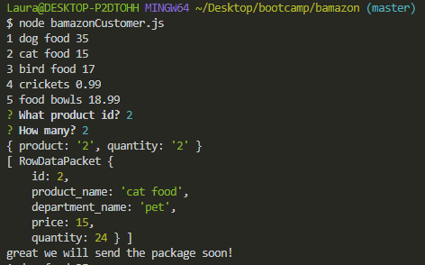
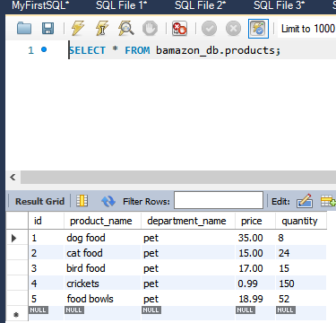

# Bamazon

**How To Use Bamazon**

1. Open your terminal.

2. Navigate to the folder that contains the bamazonCustomer.js file.

3. The output will depend on the command you run.

4. Run node bamazonCustomer.js

The stock quantity of the product chosen will reduce by the amount the customer entered.

